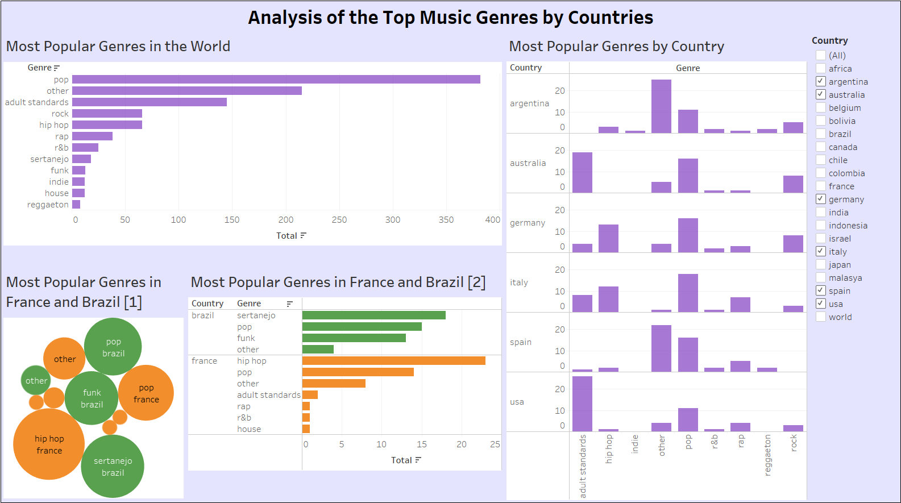

# Top Music Genres by Countries

## Description

The goal of this project was to use **Python** to collect, explore and manipulate data about something which is of great interest to me: housing information in Paris. I took upon me the challenge of doing a **WebScraping** onto the rental listing site **BienIci**.

found <a href="https://www.kaggle.com/datasets/leonardopena/top-50-spotify-songs-by-each-country" title="Download" download>here</a>.

I used **Python**, especially the packages <b/>BeautifulSoup<b/> and <b/>Pandas<b/>, to do a **WebScraping** of the housing information in Paris. After collecting the data, I used **Pandas** to **explore and manipulate the usable information** and, with the help of the dataframes, I could store and export all the information to a csv file. This csv file was used in the **Power BI** software in order to better **visualize** the collected data.

## Softwares

- Python
- Tableau

## Code

The python code, made in Jupyter Notebook, is available for your convenience at this repository files. 

## Tableau result

